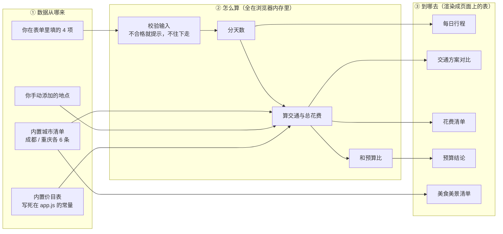

# 出行规划小助手 · 技术设计文档（TECH_DESIGN）

> Day 5 产出 ｜ 项目：`meng-vibe-coding` ｜ 日期：2026-09-20
> 前置文档：`research.md`（Day 3）、`PRD.md`（Day 4）
>
> **这份文件是干什么的**：PRD 回答「做成什么样」，本文档回答「**用什么做、为什么用它**」。
> **编写状态**：已完成（第一～七节全部写完）。

**三句话摘要**

1. **技术路线**：纯静态网页 —— HTML + CSS + 原生 JavaScript。**不用框架、不用构建工具、不引任何外部依赖。**
2. **为什么**：PRD 里的 AC1（双击就能打开）和 AC14（断网也能用）把其他路线全部排除了；而且本项目就四件事（分天数、查参考价、加总、比预算），**根本用不到框架**。
3. **代价**：内置数据只能写成 JS 常量（不能是 JSON 文件），方案不保存（PRD 已列为第二版）。

---

## 一、技术路线（选了什么）

| 项目 | 选择 |
|------|------|
| **页面** | HTML5（一个 `index.html`） |
| **样式** | CSS3（一个 `style.css`，含窄屏适配） |
| **逻辑** | 原生 JavaScript ES6+（一个 `app.js`） |
| **数据** | 写在 `app.js` 里的**常量**：价目表 + 成都/重庆清单 + 城际交通参考价 |
| **框架** | **无** |
| **构建工具** | **无**（不装 Node 依赖、不打包） |
| **外部依赖** | **无**（不用 CDN、不加载任何网络资源） |
| **怎么运行** | 双击 `index.html`，浏览器直接打开 |
| **怎么发布**（后续） | 上传到 GitHub，用 GitHub Pages 生成一个可分享的链接 |

**一句话**：**三个文件、零依赖、双击就能跑。**

---

## 二、为什么是它（理由，逐条对着 PRD 的验收标准）

| # | 理由 | 对应 PRD |
|---|------|---------|
| 1 | **不安装、不构建**，所以双击 `index.html` 就能打开，不需要任何环境 | 直接满足 **AC1** |
| 2 | **不加载任何网络资源**，所以断网刷新照样能用 | 直接满足 **AC14** |
| 3 | **不用框架**：本项目只有 4 个输入字段 + 5 块输出，没有"多个页面切换"、没有"复杂共享状态"，框架带来的好处一个都用不上 | — |
| 4 | **纯 CSS 就能做到窄屏可读**（流式布局 + 媒体查询），不需要 UI 框架 | 满足 **AC13** |
| 5 | **好排查**：总共三个文件，出问题只有三种可能——页面结构、样式、逻辑。报错直接指向行号 | — |
| 6 | **发布零成本**：GitHub Pages 天然托管静态文件，不用租服务器 | Day 7 之后要发链接 |
| 7 | **学习收益最大**：Day 7 之后你要能看懂 AI 写的每一行。原生 JS 你能读懂，打包后的框架代码读不了 | — |

**反过来算一笔账**：如果选框架，你要多付出的是——装 Node 依赖（几百 MB）、学会跑构建命令、处理构建报错、多花 1–2 天。**换回来的是零个用户能看见的好处。**

---

## 三、为什么不选它们（淘汰方案对比表）

| 方案 | 它是什么 | 为什么不选 | 什么时候才该选它 |
|------|---------|-----------|-----------------|
| **Vite + React** | 现代主流前端工程方案 | **必须先 `npm install` + 构建**，生成的网页双击 `index.html` 打不开（**违反 AC1**）；还会多出几百 MB 的依赖目录 | 项目有十几个页面、需要组件复用、多人协作时 |
| **Vue 3（CDN 引入）** | 用 `<script>` 从网上加载框架 | **断网就白屏**（**违反 AC14**），而且你的页面能不能用取决于别人网站通不通 | 页面交互很复杂（大量表单实时联动），且能接受联网 |
| **jQuery（CDN 引入）** | 老牌的网页操作库 | 同样是 CDN 问题；而且现代原生 JS 已经完全覆盖它的用途 | 维护十几年前的老项目 |
| **后端 + 数据库**（Node + SQLite 等） | 有服务器负责计算、有地方长期存数据 | 本期**没有「存下来」和「给别人看」的需求**（PRD 已定不做保存）；一旦引入就要处理服务器、部署、跨域，全是负担 | **Day 23 之后**要做「保存方案 / 多人协作」时 |
| **静态站点生成器**（如 Next.js 静态导出） | 先构建再输出静态文件 | 虽然产物也是静态的，但**开发阶段必须装工具链并构建**，门槛比收益高 | 有大量内容页、需要 SEO 时 |
| **全部塞进一个 `index.html`** | 最少的文件数 | 能跑，但一个文件很快会超过一千行，**找不到东西**，Day 7 之后每加一个功能都更难受 | 一次性小页面，代码量 200 行以内 |

**判断标准只有一条**：**这个技术解决的是我真实存在的问题，还是我以为将来会有的问题？** 上面六种都是好技术，只是**不是这个项目的解**。

---

## 四、已知的坑与规避方式（这一节最重要）

这几个坑不提前定死，Day 7 写代码时一定会撞上，而且**报错信息新手看不懂**。

| # | 坑（现象） | 原因 | 规避方式（写代码时必须遵守） |
|---|-----------|------|---------------------------|
| 1 | 双击打开页面，**JS 完全不执行**，控制台报 CORS 或直接没反应 | `file://` 协议下浏览器禁止加载「模块化脚本」（`type="module"`） | **只用普通脚本**：`<script src="app.js" defer></script>`，**绝不写 `type="module"`** |
| 2 | 想读 `data.json`，报错说请求被拒绝 | 同理，`file://` 下**不能用 `fetch()` 读本地文件**（浏览器把它当跨域请求拦掉） | **内置数据直接写成 JS 常量**（写在 `app.js` 里的数组/对象），**不读任何外部文件** |
| 3 | 以后想把 `app.js` 拆成几个文件，写了 `import` 就崩 | 还是同一个限制（`import` 属于模块化语法） | 如果真要拆，**用多个普通 `<script>` 按顺序引入**，变量挂在全局；本项目**不拆，一个 `app.js` 够用** |
| 4 | 改完代码刷新，页面没变化 | 浏览器把旧的 `app.js` 缓存住了 | 按 **`Ctrl` + `F5`** 强制刷新（这个动作你会经常用） |
| 5 | 页面上中文变乱码 | 文件没声明字符编码 | `index.html` 的 `<head>` 第一行必须有 `<meta charset="utf-8">`；所有文件**保存为 UTF-8 格式** |

> 第 1 条和第 2 条是**今天最值钱的两条**——它们直接决定了「内置价目表」和「成都/重庆清单」必须以 **JS 常量的形式**存在，而不是像大多数人想的那样存成一个数据文件。这也是今天那句要掌握的话里，"数据从哪来"的第一段答案。

---

## 五、文件结构与职责（三个文件 + 三份文档）

### 代码文件（**Day 7 才创建，今天只定结构**）

| 文件 | 职责 | 什么时候会改它 |
|------|------|---------------|
| `index.html` | 页面骨架：输入区 4 个字段 + 结果区 5 块空容器 + 底部声明 | 增删字段、改布局时 |
| `style.css` | 全部样式，含手机窄屏适配 | 改外观时 |
| `app.js` | **三件事**：① 内置数据（价目表、城市清单、交通参考价）② 计算逻辑（分天数、算总账、比预算）③ 把结果渲染成页面上的表格 | 加功能、调规则时 |

**为什么是三个文件，不是一个也不是十个**：
- **不是一个**：全部内联会让 `index.html` 上千行，找东西困难（见第三节最后一行）。
- **不是十个**：本项目只有三种职责，多拆只会增加"文件之间怎么互相找到"的复杂度。
- **一条规矩**：**改样式只动 `style.css`，改规则只动 `app.js`，改布局只动 `index.html`** —— 知道问题属于哪一类，就知道该打开哪个文件。

### 文档文件（不参与运行，但同样进仓库）

| 文件 | 属于哪天 | 作用 |
|------|---------|------|
| `AGENTS.md` | Day 1 | 项目规则（AI 的行为边界） |
| `research.md` | Day 3 | 为什么值得做 |
| `PRD.md` | Day 4 | 做成什么样、怎么验收 |
| `TECH_DESIGN.md` | **Day 5** | **用什么做、为什么**（本文件） |

---

## 六、数据流图

**看图先看三格**：左边「数据从哪来」→ 中间「在浏览器里怎么算」→ 右边「算完到哪去」。

> 注意：**图里没有「服务器」和「数据库」这两个框，这是故意的**——不是漏画，是本期根本不存在（理由见第二节）。所有计算都发生在**你自己的浏览器内存**里。



**文字版（在图渲染不出来时看这个，比如用记事本打开）**

| 数据 | 从哪来 | 参与哪一步 | 到哪去 |
|------|--------|-----------|--------|
| 价目表（参考价） | `app.js` 里的常量 | 算交通、算总花费 | 花费清单 |
| 城市清单 | `app.js` 里的常量 | 算总花费 | 美食美景清单（+ 参考花费） |
| 表单输入 4 项 | 你当场打字 | 校验 → 分天数 → 算钱 → 比预算 | 每日行程 / 交通对比 / 花费清单 / 预算结论 |
| 手动添加的地点 | 你在页面上点「添加」 | 算总花费 | 清单里单独一行「自填地点（参考）」 |

**一个容易被忽略的细节**：清单里的参考花费**只用于显示，不计入总花费合计**（PRD 里已统一口径）。所以图上 `A2 → C5` 是一条**独立的支线**，它不经过 `B3 算总花费`——**这就是"不重复计算"在图上的样子**。

---

## 七、数据从哪来、到哪去

### 今天要掌握的那句话，成品版

> **数据只来自两个地方**：一是我写在代码里的参考价和城市清单（跟着网页文件一起到你电脑上），二是用户在页面上当场填的四个字段。
> **算完之后不再去任何地方**——直接渲染成页面上的五块结果表给你看，**不发给任何服务器、不写进任何数据库**，所以断网能用，刷新就清空。
> 如果用户自己加了地点，那些内容也只在浏览器内存里待着，关掉页面就没了。

### 拆开看：四类数据各自的来路与去向

| # | 数据 | 怎么进来 | 存在哪 | 怎么出去 |
|---|------|---------|--------|---------|
| 1 | **参考价目表**（市内交通 20 元/天、住宿 90 元/晚、吃 80 元/天、门票 60 元/天） | 写死在 `app.js` 顶部的常量 | 代码文件里（不是数据库） | 参与"算总花费"，数字进花费清单；页面必须标注"**估算值，仅供参考**" |
| 2 | **城市清单**（成都、重庆各 3 吃 3 玩 + 参考花费） | 同上，写成 `app.js` 里的常量数组 | 代码文件里 | 渲染成美食美景清单；**只显示、不计入合计** |
| 3 | **表单输入**（出发地 / 城市 / 天数 / 预算） | 用户在输入框里打字 | 浏览器的内存（变量） | 先校验（不合格就提示、不继续）→ 再参与分天数、算钱、比预算 → 结果渲染成四块表 |
| 4 | **用户自填地点**（内置清单没有的城市） | 点页面上的「添加」并填写名称 + 类型 + 参考花费 | 浏览器的内存（变量） | 进该城市的清单，并单独列出；**同样不计入合计** |

### 这条链上"没有"经过什么（同样是技术路线的一部分）

| 没有经过 | 所以不会发生 |
|---------|-------------|
| 服务器（后端） | 不需要买、不需要配、不会因为别人服务器挂了而用不了 |
| 数据库 | 不存密码、不存账单、不涉及隐私；也不需要备份 |
| 任何网络请求 | **断网照样能用**（满足 PRD 的 **AC14**），**双击文件就能打开**（满足 **AC1**） |
| 任何第三方接口 | **拿不到实时票价、实时房价**，所以本期的价格一律是"参考价 + 明确标注"（PRD 已把这一项列进「本期不做」） |

### 这份数据流怎么对应到 PRD 的功能

| 数据流图里的格子 | 对应 PRD 的哪条功能 |
|-----------------|-------------------|
| `B1 校验输入` | **F1** + 错误提示 **E1–E5** |
| `B2 分天数` | **F3**（核心算法） |
| `B3 算交通与总花费` | **F4**（交通对比）+ **F5**（花费清单） |
| `B4 和预算比` | **F6**（超支给"砍哪一项"建议） |
| `C5 美食美景清单` | **F7**（内置清单）+ **F8**（用户自填） |

**下一步（Day 7 起）**：照这份文档建三个文件（`index.html` / `style.css` / `app.js`），先做数据流图中间那一格——**能输入、能算出结果、能渲染出来**，再谈好不好看。

---

## 八、可复用组件约束（Day 9 起）

**这一节是干什么的**：把"踩过一次坑、以后不该再踩"的规矩写下来。以后新加一个表格或组件，照着这一节逐条检查，就不会重复犯同样的错。

### 约束 1：表格的数字列，`<th>` 和 `<td>` **必须同时**带 `class="num"`

**规矩**：任何"数字类"的列（金额、票价、耗时、天数、数量）—— **表头 `<th>` 和这一列每一个 `<td>` 都要写 `class="num"`，一个都不能漏**。只给一边加，等于没加。

**依据**（`style.css` 里的真实写法）：

```css
/* 右对齐：注意选择器是 "td.num, th.num" —— 表头和数据格都要靠右 */
.data-table td.num, .data-table th.num {
  text-align: right;
  white-space: nowrap;
}
/* 等宽数字：只作用于数据格，表头没有数字 */
.data-table td.num {
  font-variant-numeric: tabular-nums;
  font-feature-settings: "tnum" 1;
}
```

**`tabular-nums`（等宽数字）是什么**：平时字体的每个数字宽度不一样（`1` 比 `8` 窄），所以一列金额上下看是"锯齿"的；换成**等宽数字**后每个数字一样宽，小数点自然对齐，读起来利落。

**为什么非要"两边同时"**：浏览器给表格的默认对齐是**表头左、数据左**，看着是齐的。可一旦数据格写了 `text-align: right`（`.num` 干的），**数据跑到右边、表头还留在左边** —— 同一列被拉成"两条边"，看着就是"这列没对齐"。

> **Day 9 就栽在这上面**：行程表 / 交通表 / 费用表三张表共 4 处，全是"**数据格有 `num`、表头漏了**"。而美食清单表两边都写对了 —— 这正好证明是**漏写**，不是设计如此。

**新加一张表格时的自检三步**：

1. 数这张表有几列是数字 → 去 `<th>` 那一行数出**几个** `class="num"`
2. **两个数必须相等**（表头的 `num` 个数 = 数字列列数）
3. 拿不准就按 F12 打开开发者工具，点一下表头、再点一下同列的数据格，**确认两者的 `text-align` 是同一个值**

### 约束 2：可能横向滚动的表格，外面要包一层 `.table-scroll`

**规矩**：任何可能比屏幕宽的表格，外面套一个 `<div class="table-scroll">`。

**理由**：窄屏（手机宽度）时表格会横向滚动；没有这层包裹，表格会把**整个页面撑宽**，导致"页面能左右拖动" —— 直接违反 PRD 的 **AC13**（窄屏可读、不用左右拖）。

### 约束 3：「第 N 天」胶囊只用在**每日行程表的第一列**

**规矩**：装胶囊的单元格必须带 `class="col-day"`，胶囊本身是里面的 `<span class="day-pill">`。

**三个理由**：

- 交通表第一列是「✓ 本方案选用」、分段标题行是**跨列**的「第 1 段：武汉 → 成都」—— 这些位置套上胶囊会莫名其妙。靠 `.col-day` 这个类把范围限定住。
- **胶囊要套 `span`，不能直接给 `td` 上色**：`td` 会被拉满整列宽度，胶囊就变成"一条横杠"了；`span` 是 `inline-block`，宽度才跟着字走。
- `col-day` 设了**固定宽度**（宽屏 `92px` / 窄屏 `76px`），是为了让「第 1 天」和「第 12 天」占一样宽 —— **天数从 1 位涨到 2 位时，后面的列不会跳**。

### 约束 4：颜色一律走 CSS 变量，且 `var()` 必须带兜底值

**规矩**：

- 每个颜色变量在 `:root`（明亮主题）和 `[data-theme="cyber"]`（赛博主题）**两处都要给值**。
- 用的时候写成 `var(--变量名, 兜底色)`，**兜底值不能省**。

**理由**（Day 8 踩过的大坑）：CSS 变量取不到时，`fill` / `color` 会退化成浏览器默认值 —— **在 SVG 里就是黑色**。给了兜底值，最坏也只是"颜色不太对"，不会变成一团黑。

---

*本文件为 Day 5 产出，随项目一起提交进仓库。Day 9 追加第八节「可复用组件约束」。*
