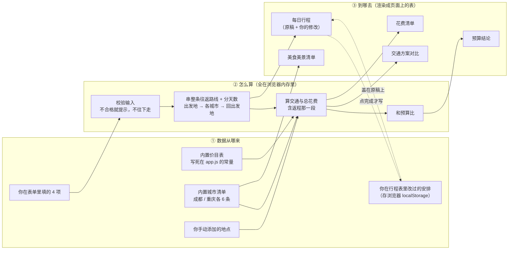

# 出行规划小助手 · 技术设计文档（TECH_DESIGN）

> Day 5 产出 ｜ 项目：`meng-vibe-coding` ｜ 日期：2026-09-20
> 前置文档：`research.md`（Day 3）、`PRD.md`（Day 4）
>
> **这份文件是干什么的**：PRD 回答「做成什么样」，本文档回答「**用什么做、为什么用它**」。
> **编写状态**：已完成（第一～八节全部写完）。
> **Day 14 追加**：第八节新增**约束 6**（多视图下"重画结果"一律全画，附一个真实踩到的 bug）。
> **Day 15 追加**：第八节新增**约束 7**（编辑型交互用"草稿"模式：编辑期间不写存档，点「完成」才写）；第七节数据流补一行「用户改过的行程安排」。
> **Day 16 追加**：第八节新增**约束 8**（同一条规则在多个时机生效时，判断和文案收敛到一个函数；附两个真实踩到的 UI 位置/擦除 bug）与**约束 9**（外链只做"渲染 / 跳转 / 说明需要联网"三件事，不参与任何计算）；第七节数据流补两行「校验的触发时机」「外部核对链接」。
> **另有一次自发修改（不属于课表的任何一天）**：响应真人测试反馈，第八节新增**约束 11**（改「汇总口径」时先分清「叠加」还是「顶替」）；第七节数据流表补一行说明「自填地点的花费」去向。

**三句话摘要**

1. **技术路线**：纯静态网页 —— HTML + CSS + 原生 JavaScript。**不用框架、不用构建工具、不引任何外部依赖。**
2. **为什么**：PRD 里的 AC1（双击就能打开）和 AC14（断网也能用）把其他路线全部排除了；而且本项目就四件事（分天数、查参考价、加总、比预算），**根本用不到框架**。
   *（第二版会加一个「真实地图视图」，那是全站唯一的联网功能，对应 **AC15**；**核心流程仍然离线可用**。）*
3. **代价**：内置数据只能写成 JS 常量（不能是 JSON 文件），方案不保存（PRD 已列为第二版）。

---

## 一、技术路线（选了什么）

| 项目 | 选择 |
|------|------|
| **页面** | HTML5（一个 `index.html`） |
| **样式** | CSS3（一个 `style.css`，含窄屏适配） |
| **逻辑** | 原生 JavaScript ES6+（一个 `app.js`） |
| **数据** | 写在 `app.js` 里的**常量**：价目表 + 成都/重庆清单 + 城际交通参考价 + **有机场的城市清单** |
| **框架** | **无** |
| **构建工具** | **无**（不装 Node 依赖、不打包） |
| **外部依赖** | **无**（不用 CDN、不加载任何网络资源） |
| **怎么运行** | 双击 `index.html`，浏览器直接打开 |
| **怎么发布**（后续） | 上传到 GitHub，用 GitHub Pages 生成一个可分享的链接 |

**一句话**：**三个文件、零依赖、双击就能跑。**

### ⚠️ Day 15 补充：上面这张表说的是「主产品」

从 Day 15 起，项目里**多了一块独立的地** `cloud/`，它的技术路线跟主产品**完全不同**：

| 项目 | 主产品（仓库根目录） | 后端探路区（`cloud/`，Day 15 起） |
|------|---------------------|--------------------------------|
| **代码** | `index.html` / `app.js` / `style.css` | `cloud/functions/` 下的三个云函数：`health/`、`cities/`、`places/` |
| **跑在哪** | **浏览器里** | **腾讯云上**（CloudBase 云函数） |
| **要不要联网** | ❌ 不要 | ✅ 要 |
| **要不要部署** | ❌ 不用，双击就开 | ✅ 要（控制台上传 / 配置触发路径） |
| **平台** | 无 | 腾讯云 CloudBase 免费体验版 |
| **环境 ID** | 无 | `travel-planner-d4g8o6mee9d231c64` |

**⚠️ 关键：这两块地不许互相引用。**

- 主产品**不能**调 `cloud/` 的接口（一调就破坏了 AC14 的"断网可用"）
- `cloud/` **不参与**主产品的任何计算（算钱永远是浏览器本地算）

> **为什么这么切**：主产品的立足点是"零门槛、断网可用"。如果把后端揉进去，
> 它立刻变成"必须联网才能用"——**那是另一个产品，不是这个**。
> 而后端是课程要学的内容，**放在 `cloud/` 里学，不牵动主产品**。

---

## 二、为什么是它（理由，逐条对着 PRD 的验收标准）

| # | 理由 | 对应 PRD |
|---|------|---------|
| 1 | **不安装、不构建**，所以双击 `index.html` 就能打开，不需要任何环境 | 直接满足 **AC1** |
| 2 | **不加载任何网络资源**，所以断网刷新照样能用（第二版那个「真实地图视图」是唯一例外，见 **AC15**，离线时置灰） | 直接满足 **AC14** |
| 3 | **不用框架**：本项目只有 4 个输入字段 + 6 块输出，没有"多个页面切换"、没有"复杂共享状态"，框架带来的好处一个都用不上 | — |
| 4 | **纯 CSS 就能做到窄屏可读**（流式布局 + 媒体查询），不需要 UI 框架 | 满足 **AC13** |
| 5 | **好排查**：总共三个文件，出问题只有三种可能——页面结构、样式、逻辑。报错直接指向行号 | — |
| 6 | **发布零成本**：GitHub Pages 天然托管静态文件，不用租服务器 | Day 7 之后要发链接 |
| 7 | **学习收益最大**：Day 7 之后你要能看懂 AI 写的每一行。原生 JS 你能读懂，打包后的框架代码读不了 | — |

**反过来算一笔账**：如果选框架，你要多付出的是——装 Node 依赖（几百 MB）、学会跑构建命令、处理构建报错、多花 1–2 天。**换回来的是零个用户能看见的好处。**

---

## 三、为什么不选它们（淘汰方案对比表）

| 方案 | 它是什么 | 为什么不选 | 什么时候才该选它 |
|------|---------|-----------|-----------------|
| **Vite + React** | 现代主流前端工程方案 | **必须先 `npm install` + 构建**，生成的网页双击 `index.html` 打不开（**违反 AC1**）；还会多出几百 MB 的依赖目录 | 项目有十几个页面、需要组件复用、多人协作时 |
| **Vue 3（CDN 引入）** | 用 `<script>` 从网上加载框架 | **断网就白屏**（**违反 AC14**），而且你的页面能不能用取决于别人网站通不通 | 页面交互很复杂（大量表单实时联动），且能接受联网 |
| **jQuery（CDN 引入）** | 老牌的网页操作库 | 同样是 CDN 问题；而且现代原生 JS 已经完全覆盖它的用途 | 维护十几年前的老项目 |
| **后端 + 数据库**（Node + SQLite 等） | 有服务器负责计算、有地方长期存数据 | **主产品不选**：本期**没有「存下来」和「给别人看」的需求**（PRD 已定不做保存）；一旦引入就要处理服务器、部署、跨域，全是负担 | **Day 23 之后**要做「保存方案 / 多人协作」时。<br>⚠️ **注意**：Day 15 起项目里**确实建了一块后端**（`cloud/`，腾讯云 CloudBase），但它**跟主产品分开跑**、不参与任何计算 —— 见下面第四节「主产品 vs 后端探路区」 |
| **静态站点生成器**（如 Next.js 静态导出） | 先构建再输出静态文件 | 虽然产物也是静态的，但**开发阶段必须装工具链并构建**，门槛比收益高 | 有大量内容页、需要 SEO 时 |
| **全部塞进一个 `index.html`** | 最少的文件数 | 能跑，但一个文件很快会超过一千行，**找不到东西**，Day 7 之后每加一个功能都更难受 | 一次性小页面，代码量 200 行以内 |

**判断标准只有一条**：**这个技术解决的是我真实存在的问题，还是我以为将来会有的问题？** 上面六种都是好技术，只是**不是这个项目的解**。

---

### ⚠️ Day 15 补充：主产品 vs 后端探路区（两块地的纪律）

这不是"技术选型"，是**项目结构的纪律**。不写下来，早晚会有人（包括我）顺手在主产品里调一次接口。

| 纪律 | 具体是什么意思 |
|------|--------------|
| **① 主产品不调后端的任何接口** | `app.js` 里出现 `fetch('https://...tcloudbase...')` 就是违规 —— 一调就破坏了 AC14 |
| **② `cloud/` 不进主产品的计算链** | 算钱、排行程永远在浏览器本地完成，**没有一个数字来自网络** |
| **③ 两块地各自独立部署** | 主产品发布一次（GitHub Pages 那个域名），`cloud/` 在 CloudBase 上单独部署 |
| **④ 改一块不要动另一块** | 改主产品的样式，不需要碰 `cloud/`；换云环境，不影响主产品 |

**为什么这么严**：因为"两块地混在一起"的后果是**不可逆的** ——
一旦主产品某处依赖了接口，它就从"断网也能用的工具"变成"必须联网的应用"，
**这个优点丢了就找不回来**（除非把那段代码删掉）。

**唯一的例外通道**：如果将来（Day 23+）真的决定让主产品用后端，
那**必须先改 PRD**（把 AC14 的口径正式改掉、说明为什么放弃离线），
**不能悄悄加一行 `fetch` 就完事**。

---

## 四、已知的坑与规避方式（这一节最重要）

这几个坑不提前定死，Day 7 写代码时一定会撞上，而且**报错信息新手看不懂**。

| # | 坑（现象） | 原因 | 规避方式（写代码时必须遵守） |
|---|-----------|------|---------------------------|
| 1 | 双击打开页面，**JS 完全不执行**，控制台报 CORS 或直接没反应 | `file://` 协议下浏览器禁止加载「模块化脚本」（`type="module"`） | **只用普通脚本**：`<script src="app.js" defer></script>`，**绝不写 `type="module"`** |
| 2 | 想读 `data.json`，报错说请求被拒绝 | 同理，`file://` 下**不能用 `fetch()` 读本地文件**（浏览器把它当跨域请求拦掉） | **内置数据直接写成 JS 常量**（写在 `app.js` 里的数组/对象），**不读任何外部文件** |
| 3 | 以后想把 `app.js` 拆成几个文件，写了 `import` 就崩 | 还是同一个限制（`import` 属于模块化语法） | 如果真要拆，**用多个普通 `<script>` 按顺序引入**，变量挂在全局；本项目**不拆，一个 `app.js` 够用** |
| 4 | 改完代码刷新，页面没变化 | 浏览器把旧的 `app.js` 缓存住了 | 按 **`Ctrl` + `F5`** 强制刷新（这个动作你会经常用） |
| 5 | 页面上中文变乱码 | 文件没声明字符编码 | `index.html` 的 `<head>` 第一行必须有 `<meta charset="utf-8">`；所有文件**保存为 UTF-8 格式** |

> 第 1 条和第 2 条是**今天最值钱的两条**——它们直接决定了「内置价目表」和「成都/重庆清单」必须以 **JS 常量的形式**存在，而不是像大多数人想的那样存成一个数据文件。这也是今天那句要掌握的话里，"数据从哪来"的第一段答案。

---

## 五、文件结构与职责（三个代码文件 + 三份文档 + 一个 Skill 目录）

### 代码文件（三个文件，Day 7 创建）

| 文件 | 职责 | 什么时候会改它 |
|------|------|---------------|
| `index.html` | 页面骨架：输入区 4 个字段 + 结果区 6 块空容器 + 底部声明 | 增删字段、改布局时 |
| `style.css` | 全部样式，含手机窄屏适配 | 改外观时 |
| `app.js` | **三件事**：① 内置数据（价目表、城市清单、交通参考价、有机场的城市清单）② 计算逻辑（串整条往返路线、分天数、算总账、比预算）③ 把结果渲染成页面上的表格 | 加功能、调规则时 |

**`app.js` 里需要单独点名的几处（新加功能时先看一眼有没有现成的能复用）**：

| 名字 | 干什么 | 为什么值得记住 |
|------|--------|---------------|
| `rowKeyOf(row)` | 把一行算成一个**稳定的 key**（在途行 `t:武汉>成都`、游玩行 `c:成都:0`） | 用户修改靠它"对号入座"。**别用"第 N 天"当 key** —— 天数一变同一个"第 3 天"就换城市了 |
| `itemsForRow(row)` | 取一行**最终要显示的内容**（编辑态→草稿；否则有存档用存档、没有用原稿） | 所有地方都从它拿内容，别直接读 `row.items` —— 那样会绕过用户的修改 |
| `editDraft` / `editingRowKey` | 编辑态的**草稿**和"正在编辑哪一行" | 编辑期间只改草稿、**不写存档**；只有「完成」才写。见约束 7 |
| `exitRowEditing()` | 退出编辑态 | 任何"换了一批新数据"的动作（重新生成 / 切方案）都要调 |
| `repaintItinerary()` | **只重画行程表那一块** | 编辑态的增删改别走整个 `generate()` —— 那会重新校验、重算钱、还闪一下加载态，太重 |

**为什么是三个文件，不是一个也不是十个**：
- **不是一个**：全部内联会让 `index.html` 上千行，找东西困难（见第三节最后一行）。
- **不是十个**：本项目只有三种职责，多拆只会增加"文件之间怎么互相找到"的复杂度。
- **一条规矩**：**改样式只动 `style.css`，改规则只动 `app.js`，改布局只动 `index.html`** —— 知道问题属于哪一类，就知道该打开哪个文件。

### 数据文件（**第二版再加，现在不建**）

| 目录 | 放什么 | 规矩 |
|------|--------|------|
| `images/` | 城市照片 —— 首页示意地图上的圆形缩略图、清单配图 | ① 只用**可商用的免费图**（Unsplash / Pexels 等）、自拍、或官方授权图；② **每张都在本文档记下出处**；③ 是**本地文件**，浏览器直接读、不联网加载，所以**不违反 AC14** |

**为什么先把位置定死**：PRD 第二版的「示意路线地图」要用到城市缩略图，得有个固定地方放。现在写清楚目录名和三条规矩，省得以后随手新建目录、名字乱起（`AGENTS.md` 8.5 就是防这个的）。

### 项目内的 Skill（Day 12 起）

| 目录 | 放什么 | 怎么用 |
|------|--------|--------|
| `.workbuddy/skills/` | 项目自带的 Skill —— 一个文件夹 + 一份 `SKILL.md`（需要时再加 `scripts/`）。目前只有 `filter-interaction` 一个 | 要写「筛选」类交互**之前**先读它的 `SKILL.md`；写完跑 `node .workbuddy/skills/filter-interaction/scripts/check-filter.js`，这一次的结果会写进同目录的 `LAST_RUN.md` |

**它和那几份文档有什么区别**：`PRD.md` 这些是**写给人看的**；Skill 是**写给 AI 看的、而且能自己动手**——它不只列规矩，还带一个会真加载页面、真点按钮、逐项断言的检查脚本。所以「按 Skill 做了」这件事**有据可查**，不是一句口头保证。

**它不参与运行**：Skill 目录只在"开发与检查"时用，网页本身（那三个文件）完全不依赖它，**不影响 AC1 / AC14**。

### 文档文件（不参与运行，但同样进仓库）

| 文件 | 属于哪天 | 作用 |
|------|---------|------|
| `AGENTS.md` | Day 1 | 项目规则（AI 的行为边界） |
| `research.md` | Day 3 | 为什么值得做 |
| `PRD.md` | Day 4 | 做成什么样、怎么验收 |
| `TECH_DESIGN.md` | **Day 5** | **用什么做、为什么**（本文件） |
| `README.md` | Day 7 | 运行说明：怎么打开、想改价格 / 城市数据该动哪一行 |

---

## 六、数据流图

**看图先看三格**：左边「数据从哪来」→ 中间「在浏览器里怎么算」→ 右边「算完到哪去」。

> 注意：**图里没有「服务器」和「数据库」这两个框，这是故意的**——不是漏画，是本期根本不存在（理由见第二节）。所有计算都发生在**你自己的浏览器内存**里。


```mermaid
flowchart LR
    subgraph S1["① 数据从哪来"]
        A1["内置价目表<br/>写死在 app.js 的常量"]
        A2["内置城市清单<br/>成都 / 重庆各 6 条"]
        A3["你在表单里填的 4 项"]
        A4["你手动添加的地点"]
        A5["你在行程表里改过的安排<br/>（存浏览器 localStorage）"]
    end
    subgraph S2["② 怎么算（全在浏览器内存里）"]
        B1["校验输入<br/>不合格就提示，不往下走"]
        B2["串整条往返路线 + 分天数<br/>出发地 → 各城市 → 回出发地"]
        B3["算交通与总花费<br/>含返程那一段"]
        B4["和预算比"]
    end
    subgraph S3["③ 到哪去（渲染成页面上的表）"]
        C1["每日行程<br/>（原稿 + 你的修改）"]
        C2["交通方案对比"]
        C3["花费清单"]
        C4["预算结论"]
        C5["美食美景清单"]
    end
    A3 --> B1
    A1 --> B3
    A4 --> B3
    A2 --> B3
    A2 --> C5
    B1 --> B2 --> B3 --> B4
    B2 --> C1
    B3 --> C2
    B3 --> C3
    B4 --> C4
    A5 -.->|"盖在原稿上"| C1
    C1 -.->|"点完成才写"| A5
```

**图上那条虚线（Day 15 新增）**：`A5 ⇢ C1` 是「每日行程」独有的 —— 它的内容**不止一个来源**：
程序算出来的**原稿**，加上用户自己改过的部分（存在浏览器 `localStorage` 里）。渲染时**有修改就用修改、没有就用原稿**。
反过来 `C1 ⇢ A5` 那条：**只有点「完成」才写**，编辑过程中不写（所以「取消」才有东西可取消）。细节见第八节**约束 7**。
**注意它是一条独立的支线，不碰 `B3 算总花费`** —— 改安排不会改动任何金额。

**文字版（在图渲染不出来时看这个，比如用记事本打开）**

| 数据 | 从哪来 | 参与哪一步 | 到哪去 |
|------|--------|-----------|--------|
| 价目表（参考价） | `app.js` 里的常量 | 算交通、算总花费 | 花费清单 |
| 内置城市清单 | `app.js` 里的常量 | **不参与算总花费**（只用于显示参考花费） | 美食美景清单（+ 参考花费） |
| 表单输入 4 项 | 你当场打字 | 校验 → 分天数 → 算钱 → 比预算 | 每日行程 / 交通对比 / 花费清单 / 预算结论 |
| **你手动添加的地点**（本次改动后进总账） | 你在页面上点「添加」 | **参与算总花费**：按城市、按类别「取较大值**顶替**」该城的人均标准（见约束 11） | 清单里单独一行「自填地点（参考）」；「吃 / 门票」两行的明细里会写明哪几座城改按你列的算 |
| **改过的行程安排**（Day 15） | 点行程表里的「编辑」改完、点「完成」 | **不参与任何计算** | 存浏览器 `localStorage`；渲染「每日行程」时**盖在**程序原稿上，刷新仍在 |

**一个容易被忽略的细节（这次改过口径 —— 别再用旧说法）**：

清单里的花费**不是"一律不进总账"**，要分成两种：

| | 进不进总账 | 为什么 |
|---|---|---|
| **内置清单**（成都/重庆那 6 条） | ❌ **完全不进** | 那只是"给你看看的建议"，你**没选中任何一条**，替你算钱没道理 |
| **你自己添加的地点** | ✅ **进，但用「顶替」不用「相加」** | 那是你**明确要去**的；直接相加会和人均标准重复计算（见约束 11） |

**所以图上 `A4 → B3` 是一条真支线，而 `A2 → C5` 是独立的**（内置清单绕过算钱那一步）——
**这就是"不重复计算"在图上的样子**。
**注意别把 `A2`（内置清单）也接到 `B3`**：那会把"建议"当成"你选的东西"来算钱。

---

## 七、数据从哪来、到哪去

### 今天要掌握的那句话，成品版

> **数据只来自两个地方**：一是我写在代码里的参考价和城市清单（跟着网页文件一起到你电脑上），二是用户在页面上当场填的四个字段。
> **算完之后不再去任何地方**——直接渲染成页面上的结果表给你看（**六个块，分在「整体方案 / 每日行程 / 账本」三个视图里**，点标签切换，纯前端显隐、不发新请求），**不发给任何服务器、不写进任何数据库**，所以断网能用，刷新就清空。
> 如果用户自己加了地点，那些内容也只在浏览器内存里待着，关掉页面就没了。

### 拆开看：四类数据各自的来路与去向

| # | 数据 | 怎么进来 | 存在哪 | 怎么出去 |
|---|------|---------|--------|---------|
| 1 | **参考价目表**（市内交通 20 元/天、住宿 90 元/晚、吃 80 元/天、门票 60 元/天，以及各交通方式的单价/时速） | 写死在 `app.js` 顶部的常量 | 代码文件里（不是数据库） | 参与"算总花费"，数字进花费清单；页面必须标注"**估算值，仅供参考**" |
| 2 | **城市清单**（成都、重庆各 3 吃 3 玩 + 参考花费） | 同上，写成 `app.js` 里的常量数组 | 代码文件里 | 渲染成美食美景清单；**只显示、不计入合计** |
| 3 | **表单输入**（出发地 / 城市 / 天数 / 预算） | 用户在输入框里打字 | 浏览器的内存（变量） | 先校验（不合格就提示、不继续）→ 再参与分天数、算钱、比预算 → 结果渲染成六个块（分在三个视图里） |
| 4 | **用户自填地点**（内置清单没有的城市） | 点页面上的「添加」并填写名称 + 类型 + 参考花费 | 浏览器的内存（变量） | 进该城市的清单，并单独列出；**同样不计入合计** |
| 5 | **有机场的城市清单**（哪些城市之间能列"飞机"这个选项） | 同样写死在 `app.js` 里的常量 | 代码文件里 | 决定每段交通里**飞机这一档出不出来**；只影响"列不列"，不参与金额计算 |
| 6 | **用户改过的行程安排**（每日行程里"大致安排"那一格被自己改过的内容，Day 15） | 点某行的「编辑」改完、点「完成」 | **浏览器的 `localStorage`**（key：`meng-vibe-coding:itineraryEdits`） | 渲染时**盖在**程序算出来的原稿上（按"行 key"对号入座）；**刷新页面后仍在**；点「清空重填」时一并清掉。**不进任何金额计算** —— 当天的花费是按人天固定标准估的，跟安排写了什么无关 |
| 7 | **国内城市白名单**（判断用户填的是不是国内城市，Day 14 加） | 写死在 `app.js` 里的 `CN_CITIES` 常量（370 条）+ 俗称表 `CN_CITY_ALIAS`（11 条） | 代码文件里 | 校验阶段用（PRD 的 **E6**）：不是国内城市就拦住、不生成方案。**也不参与金额计算** |
| 8 | **校验的触发时机**（Day 16 加） | — | — | E6 这条规则在**三个时机**执行：① 点「添加」城市时（靠 `addCity` 里调 `isKnownChineseCity`）② 离开「出发城市」输入框时（`blur` → `checkFromCity`）③ 点「生成方案」时（`validateInput` 兜底）。三处**共用同一个文案函数** `unsupportedCityMessage`，改口径只改一处。详见 PRD「校验发生的时机」 |
| 9 | **外部核对链接**（Day 16 加） | 三个地址常量写在 `app.js` 里：`URL_12306`、`amapRouteUrl()` 拼的高德 URI | 代码文件里（**不是**运行时从网络取） | 渲染时插进交通表的 `<a>`；**只渲染不请求**，所以断网也在、AC14 不受影响。分配规则见 PRD；`lookupLinkFor(leg, option)` 决定"这一行给哪个链接"，**返回 `null` = 刻意不给**（飞机） |

### 这条链上"没有"经过什么（同样是技术路线的一部分）

| 没有经过 | 所以不会发生 |
|---------|-------------|
| 服务器（后端） | 不需要买、不需要配、不会因为别人服务器挂了而用不了 |
| 数据库 | 不存密码、不存账单、不涉及隐私；也不需要备份 |
| 任何网络请求 | **断网照样能用**（满足 PRD 的 **AC14**），**双击文件就能打开**（满足 **AC1**）。第二版若加「真实地图视图」，它是全站唯一联网点，见 **AC15** |
| 任何第三方接口 | **拿不到实时票价、实时房价**，所以本期的价格一律是"参考价 + 明确标注"（PRD 已把这一项列进「本期不做」） |

### 这份数据流怎么对应到 PRD 的功能

| 数据流图里的格子 | 对应 PRD 的哪条功能 |
|-----------------|-------------------|
| `B1 校验输入` | **F1** + 错误提示 **E1–E5** |
| `B2 串往返路线 + 分天数` | **F3**（核心算法，路线首尾闭合、含返程） |
| `B3 算交通与总花费` | **F4**（交通对比，含返程段）+ **F5**（花费清单） |
| `B4 和预算比` | **F6**（超支给"砍哪一项"建议） |
| `C5 美食美景清单` | **F7**（内置清单）+ **F8**（用户自填）+ **F9**（筛选只看某类） |
| `B1-b 画每日行程` | **F10**（「当天大致安排」可编辑：改文字 / 加一条 / 上下移 / 删除；改完存 `localStorage`，重画时盖回原稿上） |

**下一步（Day 7 起）**：照这份文档建三个文件（`index.html` / `style.css` / `app.js`），先做数据流图中间那一格——**能输入、能算出结果、能渲染出来**，再谈好不好看。

---

## 八、可复用组件约束（Day 9 起）

**这一节是干什么的**：把"踩过一次坑、以后不该再踩"的规矩写下来。以后新加一个表格或组件，照着这一节逐条检查，就不会重复犯同样的错。

### 约束 1：表格的数字列，`<th>` 和 `<td>` **必须同时**带 `class="num"`

**规矩**：任何"数字类"的列（金额、票价、耗时、天数、数量）—— **表头 `<th>` 和这一列每一个 `<td>` 都要写 `class="num"`，一个都不能漏**。只给一边加，等于没加。

**依据**（`style.css` 里的真实写法）：

```css
/* 右对齐：注意选择器是 "td.num, th.num" —— 表头和数据格都要靠右 */
.data-table td.num, .data-table th.num {
  text-align: right;
  white-space: nowrap;
}
/* 等宽数字：只作用于数据格，表头没有数字 */
.data-table td.num {
  font-variant-numeric: tabular-nums;
  font-feature-settings: "tnum" 1;
}
```

**`tabular-nums`（等宽数字）是什么**：平时字体的每个数字宽度不一样（`1` 比 `8` 窄），所以一列金额上下看是"锯齿"的；换成**等宽数字**后每个数字一样宽，小数点自然对齐，读起来利落。

**为什么非要"两边同时"**：浏览器给表格的默认对齐是**表头左、数据左**，看着是齐的。可一旦数据格写了 `text-align: right`（`.num` 干的），**数据跑到右边、表头还留在左边** —— 同一列被拉成"两条边"，看着就是"这列没对齐"。

> **Day 9 就栽在这上面**：行程表 / 交通表 / 费用表三张表共 4 处，全是"**数据格有 `num`、表头漏了**"。而美食清单表两边都写对了 —— 这正好证明是**漏写**，不是设计如此。

**新加一张表格时的自检三步**：

1. 数这张表有几列是数字 → 去 `<th>` 那一行数出**几个** `class="num"`
2. **两个数必须相等**（表头的 `num` 个数 = 数字列列数）
3. 拿不准就按 F12 打开开发者工具，点一下表头、再点一下同列的数据格，**确认两者的 `text-align` 是同一个值**

### 约束 2：可能横向滚动的表格，外面要包一层 `.table-scroll`

**规矩**：任何可能比屏幕宽的表格，外面套一个 `<div class="table-scroll">`。

**理由**：窄屏（手机宽度）时表格会横向滚动；没有这层包裹，表格会把**整个页面撑宽**，导致"页面能左右拖动" —— 直接违反 PRD 的 **AC13**（窄屏可读、不用左右拖）。

### 约束 3：「第 N 天」胶囊只用在**每日行程表的第一列**

**规矩**：装胶囊的单元格必须带 `class="col-day"`，胶囊本身是里面的 `<span class="day-pill">`。

**三个理由**：

- 交通表第一列是「✓ 本方案选用」、分段标题行是**跨列**的「第 1 段：武汉 → 成都」或「**返程：西安 → 武汉**」—— 这些位置套上胶囊会莫名其妙。靠 `.col-day` 这个类把范围限定住。
- **胶囊要套 `span`，不能直接给 `td` 上色**：`td` 会被拉满整列宽度，胶囊就变成"一条横杠"了；`span` 是 `inline-block`，宽度才跟着字走。
- `col-day` 设了**固定宽度**（宽屏 `92px` / 窄屏 `76px`），是为了让「第 1 天」和「第 12 天」占一样宽 —— **天数从 1 位涨到 2 位时，后面的列不会跳**。

### 约束 4：颜色一律走 CSS 变量，且 `var()` 必须带兜底值

**规矩**：

- 每个颜色变量在 `:root`（明亮主题）和 `[data-theme="cyber"]`（赛博主题）**两处都要给值**。
- 用的时候写成 `var(--变量名, 兜底色)`，**兜底值不能省**。

**理由**（Day 8 踩过的大坑）：CSS 变量取不到时，`fill` / `color` 会退化成浏览器默认值 —— **在 SVG 里就是黑色**。给了兜底值，最坏也只是"颜色不太对"，不会变成一团黑。

### 约束 5：筛选类交互照 Skill 的 5 条规矩做，并用它的脚本自检（Day 12 起）

**规矩**：以后再做「筛选 / 分类切换」（把一长串内容按类型只看一部分），**先读 `.workbuddy/skills/filter-interaction/SKILL.md`**。它的 5 条，一句话版：

1. **必须有「全部」这一档** —— 只能筛进去、回不来的筛选就是死路
2. **三种状态都要有交代**：有结果（说清筛出几条）/ **没结果（必须写一句话，绝不能留一片空白）** / 恢复原样（一条不多一条不少）
3. **反馈不能只靠颜色**（色弱用户分不出深浅）—— 要有文字、形状、边界的变化；文字是最明确的一档
4. **键盘和读屏要能用**：真 `<button>`（Tab 能到、回车能触发）+ `aria-pressed` 标当前档 + `aria-live` 播报命中条数
5. **样式照约束 4 走**：颜色只用 CSS 变量、`var()` 带兜底、**两套主题对比度都达标**（正文 ≥ 4.5:1）

**它和前四条约束的区别**：约束 1–4 靠**人工自查**；这一条配了**能自己动手的检查脚本** ——

```bash
node .workbuddy/skills/filter-interaction/scripts/check-filter.js
```

它会真把页面加载起来、真去点按钮、逐项断言（目前 60 项），并把这次的结果写进同目录的 `LAST_RUN.md`。**那份文件就是「规矩确实被执行过」的证据**，比"我看过了"硬。

### 约束 6：视图有多个时，「重画结果」**一律无条件全画**，别按"当前哪个视图"挑着画（Day 14 补）

**规矩**：任何"重新计算 → 刷新页面结果"的函数（切方案、改输入、加自填地点…），**必须把六个结果块全部重画一遍**，**不许**写成"只看当前视图里那几块"。

**反面写法（Day 13 写错、Day 14 抓到）**：

```js
// ❌ 错：以为这样能省掉"画了也没人看"的浪费
var inView = VIEWS[currentView];
if (inView.indexOf('block-itinerary') >= 0) { renderItinerary(...); }
if (inView.indexOf('block-cost') >= 0)      { renderCost(...); }
```

**为什么错**：`currentView` 是 `'plan'` 时，`applyView` 早把 `block-itinerary / block-cost / block-budget` 设成了 `hidden = true`。切方案**并不会**把 `currentView` 改成 `'trip'`，所以那三块**永远轮不到重画**。用户看到的现象是：

> 点「按这套重新算」→ 卡片上的「正在看这套」标记变了、"在路上 N 天"也变了，**但下面的行程表和花费表还是旧方案的数字**。

**这是最难发现的一类 bug**：页面**不报错**、部分区域**确实更新了**，只有一部分数字悄悄停在旧值上。光看截图看不出来（两块都"长得对"），**必须真的点一下、把切换前后两边的数字都对一遍**才发现。

**正确写法**：

```js
// ✅ 对：全画。往 hidden 的块里写内容不显示、不可见，用户完全无感；
//        下次切到那个视图，applyView 把 hidden 一解开，看到的就已经是新内容。
renderPlans(lastPlans, activePlanId);
renderItinerary(picked.split, lastInput);
renderTransport(picked.split, chosenKeys);
renderCost(picked.cost);
renderBudget(verdict);
```

**判断标准**：**重画两张表的成本，远低于"数字对不上"的代价**。只要开始纠结"这块现在要不要画"，就已经写错了 —— 一律画。

**配套的验证动作**（以后每次改"切方案 / 重算"都要跑）：**在三个视图里各切一次方案**，每次都比较切换前后的「合计」和「在路上 N 天」有没有真的变。只在默认视图里测是**测不出这个 bug 的**。

---

### 约束 7：编辑型交互用「草稿」模式 —— 编辑期间不写存档，点"完成"才写（Day 15 补）

**适用场景**：任何"点开一格里编辑、有取消按钮"的交互（Day 15 的「当天大致安排」可编辑就是第一个）。

**规矩**：**分三层，别混** ——

| 层 | 存哪 | 谁能改 |
|----|------|--------|
| ① **原稿** | AI/程序算出来的数据（每次重画都会重新生成） | 谁都不改 |
| ② **存档** | 用户确认过的修改（`localStorage`） | **只有点「完成」时写** |
| ③ **草稿** | 正在编辑中的临时内容（内存里一份，退出就丢） | 编辑期间的每个动作都改它 |

渲染时按 ①→②→③ 的优先级取：**编辑态看草稿**，否则**有存档看存档、没有看原稿**。

**为什么不能省掉草稿（两个都踩过）**：

1. **直接改存档** → 「取消」取消不掉。用户点开编辑、点了「+ 加一条」，存档已经被写脏了，这时点「取消」，内容却回不去 —— 而用户对「取消」的理解是"这次编辑整个不要了"。
2. **只读 DOM 不存草稿** → 「+ 加一条」这种动作在 DOM 里**没有落点**（要加的是一个还不存在的空输入框），而且每次操作都得先把用户没提交的字抠出来，绕且易错。

**必须记住的几个连带约定**：

- **「完成」是唯一写存档的地方**。写之前**过滤掉空白条目**，否则只读态会出现「；；」这种空条。
- **草稿里不能过滤空条目** —— 「+ 加一条」加的就是空的，过滤掉等于按钮没反应。
- **一次只允许一处处于编辑态**（`editingRowKey` 只存一个 key）。多处同时可编辑会出现"改到一半算不算数"这种说不清的状态。
- **渲染时要核对"正在编辑的那一行还在不在"**：数据换了（改天数、切方案）那一行可能已经不存在，此时要作废编辑态，否则 `editingRowKey` 永远匹配不上 → 用户点「编辑」没反应**且不报错**。
  - ⚠️ **核对要在"画完之后按结果比对"，不能在"开工前一律清空"** —— 因为"点编辑"这个动作本身就是【先设 key、再重画】，一进来就清会把编辑态入口干掉（Day 15 真犯过：点编辑毫无反应）。
- **「换了一批新数据」的动作要显式退出编辑态**：重新生成 / 切方案。用户的**修改**照样保留（在存档里），丢掉的只是"正在编辑"这个动作状态。

**配套的验证动作**（改这类交互都要跑，对应 PRD 的 **AC20**）：改一次 →**核对钱没变** → 刷新看还在 → 重新生成看还在 → **重新生成后还能再点开编辑**（这条专门抓"key 被卡死"）→ 清空重填看没了。窄屏（约 400px）还要单独看一次编辑块有没有被顶出屏幕（对应 **AC21**）。

---

### 约束 8：同一条规则在多个时机生效时，文案要收敛到一个函数（Day 16 补）

**适用场景**：任何"同一条校验/提示，要在不止一个入口触发"的情况。E6（只能填国内城市）就是第一个 —— 它要在**点「添加」、离开「出发城市」输入框、点「生成方案」**三个时机都生效。

**规矩**：**判断逻辑和文案都要各有一份唯一来源。**

| 内容 | 唯一来源 | 其余地方怎么做 |
|------|---------|--------------|
| "是不是国内城市" | `isKnownChineseCity()` | 三处都调它，**不许各写各的判断** |
| 提示那句文案 | `unsupportedCityMessage(name)` | 三处都调它，**不许各写各的字符串** |

**为什么**：这次差点犯。E6 的文案原本在 `validateInput` 里写死了一遍，加①②两个时机时要是再抄两遍，将来支持范围一变（比如扩到港澳台细化、或加了新城市），**改漏一处就会出现"同一件事两种说法"** —— 用户看到哪个算哪个，最糟的是两种说法互相矛盾。

**连带的三条约定**：

1. **报错要贴在出错的控件旁边**。这次第一版把「想去的城市」的红字放在最底下、排在"按游玩顺序填写"那块蓝框**后面**，实测截图发现：用户点「添加」时眼睛在按钮那儿，提示跑到底下**根本看不见**。→ 红字必须紧跟输入框。
2. **条件不成立时要【主动擦掉】旧提示**。第一版 `checkFromCity` 只在"不合法"时写红字，"改成合法的"那条路直接 `return` —— 结果用户把「东京」改成「武汉」，红字还挂着，会以为改了不起作用。→ 合法/清空都要 `clearFieldError`。
3. **拦截顺序要按"严重程度"排，不按代码顺手程度**。「不是国内城市」要排在「已经加过」「最多 4 个」**之前**：后两条是"城市没问题、只是加不进去"，前一条是"这个城市根本用不了"。

**配套的验证动作**：三处各写一组用例（`e7-inline-block.js` 覆盖①②、`e6-validate.js` 覆盖③），并且**必须包含"改对了提示会消失"这一条** —— 只测"错的时候报不报"，测不出第 2 条那个 bug。

---

### 约束 9：外链是"增强"，不参与计算，也不改变离线承诺（Day 16 补）

**适用场景**：往页面里加任何指向外站的链接（Day 16 的 12306 / 高德核对入口是第一批）。

**规矩**：**外链只做三件事 —— 渲染、跳转、说明自己需要联网。** 除此之外什么都不许干。

| 允许 | 禁止 |
|---|---|
| 把地址写死在 `app.js` 常量里 | **运行时发请求去取地址**（断网就没了） |
| 渲染成 `<a href>`，用户点了才跳 | 页面加载时自动请求目标站（**会拖慢首屏，且暴露来源**） |
| 在文案里说明"这些链接需要联网" | 让外链决定任何**计算结果**（票价、距离、方案选择） |

**为什么**：AC14 承诺"断网核心流程照常可用"。**唯一能守住这条的方式，是让外链完全待在计算链路之外。** 一旦某个数字来自网络请求，断网时页面就会出 `NaN` 或空值 —— 那才是真正的破坏。

**配套的三条硬性要求**：

1. **`target="_blank"` 必须配 `rel="noopener noreferrer"`**。不加的话，跳过去那个页面能通过 `window.opener` 拿到我们页面的引用并改写它，是个已知的钓鱼风险。**这不是可选项。**
2. **拿不到的官方站，就别编一个出来。** 飞机没有官方统一查询站 → **不给链接**，只给一句"请到各航司官网查询"。**"刻意不给"要在代码注释里写明是刻意的**（`lookupLinkFor` 返回 `null`），否则下次改代码的人会以为漏了。
3. **别假装"点开就有答案"。** 12306 没有"带着起终点直接出结果"的公开链接格式 → 链接文字写「去 12306 查」，不写「查票价」。

**配套的验证动作**（`links-check.js`）：① 链接出现在该出现的地方；② **链接不出现在不该出现的地方**（飞机行、非火车行）；③ 全表**不含任何商业票务平台域名**；④ `https` / `target` / `rel` 逐项断言；⑤ 断网场景下方案、行程、账本照常。

**⚠️ 写这类测试的两个坑（都踩了）**：
- **判"这一行是什么"要读【那一列】的原文，不要用整行 `textContent.indexOf()` 去扫** —— 整行里混着说明文字，一扫就误判。第一版把"拼车"行也算成火车行了。
- **测试要挑"真的会触发"的输入**。第一版用「武汉→乌鲁木齐」想验飞机行，结果那个组合本来就不出飞机 → 测试静默"通过"了。**挑不到就明确打「未覆盖」，不要让它假装通过。**

---

### 约束 10：云函数的返回格式要**按调用方式**分岔，不能只写一种（Day 15 补）

**适用场景**：写任何云函数（Day 15 的 `/api/health` 是第一个）。

**踩到的坑**：一开始写的是 `return { ok: true, ... }` —— **SDK 调用这样没问题，但浏览器直接打开网址会出问题**。

**为什么**：云函数有两种被调用的途径，它们对"返回什么"要求**不一样**：

| 调用方式 | 谁来调 | 期望的返回 | 只返回对象会怎样 |
|---|---|---|---|
| **SDK 调用** | 小程序 / 前端 SDK | 直接返回对象即可 | 正常 |
| **HTTP 访问** | 浏览器打开网址 / curl | 必须返回 `{statusCode, headers, body}` | 浏览器**不知道内容类型是 JSON、也不知道状态码**，可能显示乱码或报错 |

**规矩**：**云函数入口里判断 `event.httpMethod` 是否存在**，据此返回不同结构。

```js
const isHttpRequest = !!(event && event.httpMethod);
if (isHttpRequest) {
  return {
    statusCode: 200,
    headers: { 'Content-Type': 'application/json; charset=utf-8', ... },
    body: JSON.stringify(data),          // ⚠️ body 必须是【字符串】
  };
}
return data;                              // SDK 调用：直接给对象
```

**三个必须注意的点**：

1. **`headers` 里 `Content-Type` 要带 `charset=utf-8`**。不带的话，中文可能乱码 —— 这是我们踩过的同一类坑（Day 8 的 CSS 乱码）。
2. **`body` 必须是字符串**（`JSON.stringify` 过的），不能直接塞对象。塞对象的话拿到的是 `[object Object]`。
3. **返回值里放一个每次都会变的东西**（我们放的是 `time` / `uptimeSeconds`）。**这样才分得清"真通了"和"看到的是浏览器缓存"。** 没有它，你会对着一个缓存的旧结果排查半天。

**配套的验证动作**（`health-unit.js` / `health-e2e.js`）：
- 两种调用方式**各测一遍**，断言返回结构不同
- 断言 HTTP 方式下 `body` 能被 `JSON.parse` 回来、**中文没乱码**
- 断言两次调用的 `time` **不一样**（证明是实时跑的）
- 断言 `event` 为 `null` 时**不崩**

---

### 约束 11：改动「汇总口径」时，**先分清是「叠加」还是「顶替」**（补充）

**适用场景**：任何"用户在明细里填了数值、这个数值要不要进汇总"的功能。
本项目里是"自填地点的花费要不要进总花费"，但规律是通用的。

**踩到的坑**：Day 4 定的规矩是「清单一律不计入合计」，理由是怕重复计算。
Day 14 真人测试时碧儿反问「加了地点总价怎么没变」，眼看就要改成「直接加上去」。

**如果真改成"直接相加"会怎样**：总账里的「吃 80/天」「门票 60/天」本来就是**按人均估**的，
已经包含"要吃几顿、买几张门票"。再把明细里的钱全额加上去，就是**同一笔钱算两遍** ——
总价虚高 → 而"够不够"正是本工具的核心价值 → **会误报"超支"**。

**规矩：明细数值进汇总，一律先问这两句。**

| 问题 | 如果答案是"是" → 用**顶替** | 如果答案是"否" → 用**叠加** |
|---|---|---|
| **这个汇总项里，是不是本来就包含了明细所指的那笔开销？** | `max(标准, 明细合计)`，逐项取较大值 | 直接相加 |

本项目的落法：**按城市、按类别取较大值**
（`吃 = max(80 × 该城天数, 该城自填"吃"合计)`，门票同理），在途日仍按标准。

**⚠️ 用「顶替」就必须配一条说明，否则一定会被当成 bug。**

因为"取较大值"有个反直觉的地方：**明细没超过标准时，汇总一分钱都不会变**。
用户看到的就是"我加了东西但数字没动" —— 这正是碧儿反馈的根源，属于**静默失败**。

所以页面上必须写出来，而且要**分情况**写：

| 用户做了什么 | 汇总 | 页面上必须说 |
|---|---|---|
| 只填名称、数值留空 | 不变 | 不必说（等于没提供信息） |
| 填了、但没超标准 | 不变 | 「XX 你填的未超标准，仍按标准算」 |
| 填了、且超了标准 | 按差额涨 | 「XX 按你填的算」 |

**配套的验证动作**（`.git/_test-day17/selfadded-cost.js`）：
- 四种情况**各测一遍**（上面表格的每一行）
- **⚠️ 预期值别写死数字**，要用**另一段独立实现**算出来再对 ——
  第一版把预期写成"吃 = 1000"，其实那一行是**所有城市的总和**，
  写死数字会掩盖"我理解错了公式"这类错误（测试挂了，查下去才发现在测自己写错的预期）
- 必须断言：**没有任何明细时，汇总与改动前逐分一致**（改了实现，不改数字）

---

*本文件为 Day 5 产出，随项目一起提交进仓库。Day 9 追加第八节「可复用组件约束」；Day 12 追加约束 5（筛选交互照 Skill 做 + 脚本自检）；Day 14 追加约束 6（多视图下重画结果一律全画）；Day 15 追加约束 7（编辑型交互用草稿模式）；Day 16 追加约束 8（同规则多时机生效时文案收敛到一个函数）与约束 9（外链是增强、不参与计算）；**Day 15（同日第二批）追加约束 10（云函数返回格式要分调用方式）+ 第三节「主产品 vs 后端探路区」+ 第一节末尾的两块地对照表**；**另追加约束 11（改汇总口径先分清"叠加"还是"顶替"）**。*
